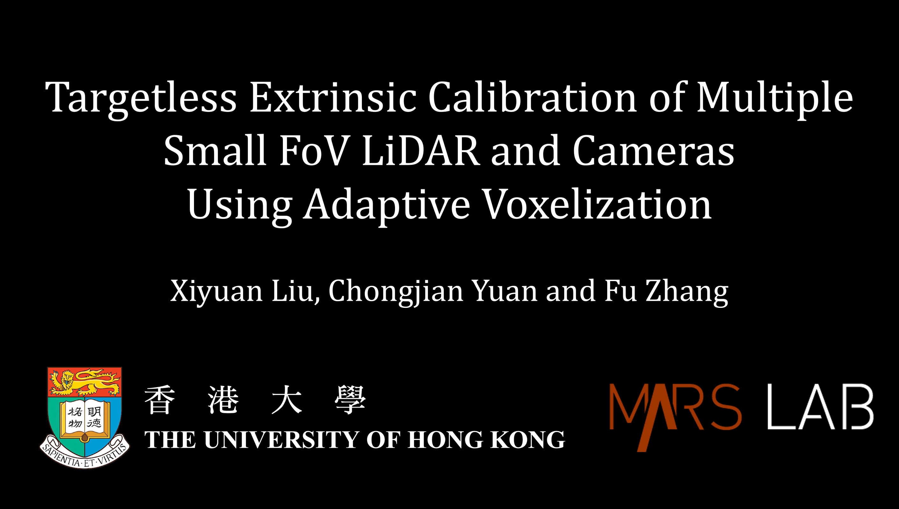
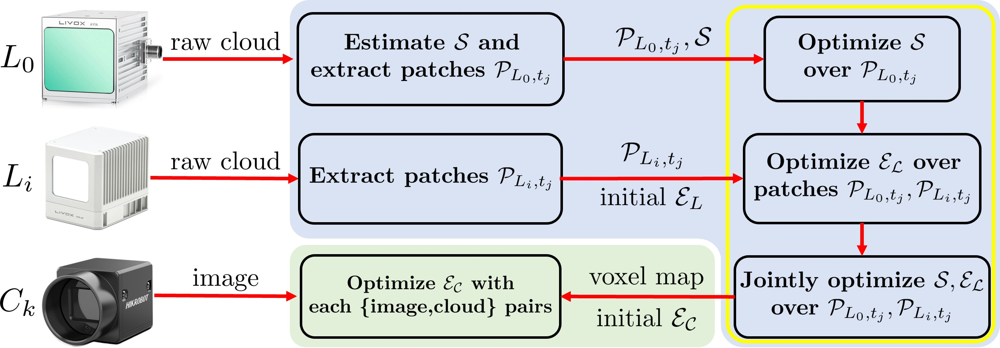
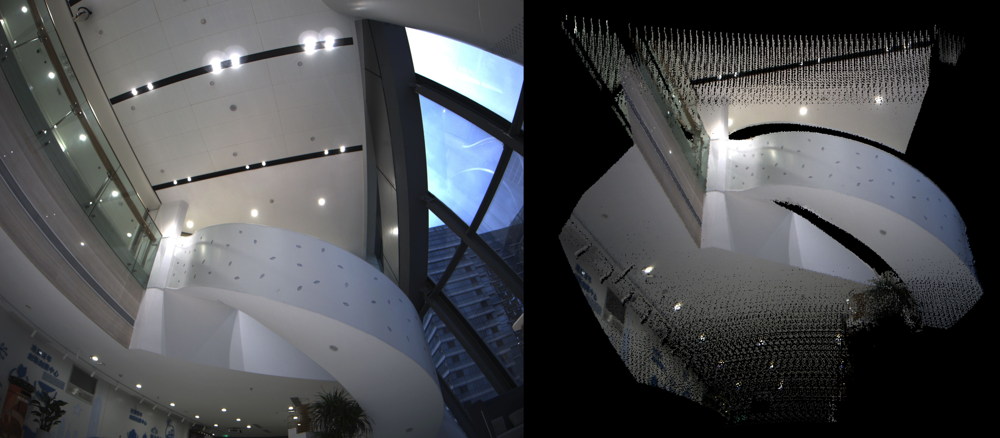

# Targetless Extrinsic Calibration of Multiple Small FoV LiDARs and Cameras using Adaptive Voxelization

Our journal paper is available on [IEEE TIM](https://ieeexplore.ieee.org/document/9779777). The pre-release code has been updated. Our experiment video is available on [YouTube](https://youtu.be/PaiYgAXl9iY) and [Bilibili](https://www.bilibili.com/video/BV1p64y1h7ae?spm_id_from=333.999.0.0). Please consider citing our paper if you find our code useful.

```
@ARTICLE{9779777,
  author={Liu, Xiyuan and Yuan, Chongjian and Zhang, Fu},
  journal={IEEE Transactions on Instrumentation and Measurement},
  title={Targetless Extrinsic Calibration of Multiple Small FoV LiDARs and Cameras Using Adaptive Voxelization},
  year={2022},
  volume={71},
  number={},
  pages={1-12},
  doi={10.1109/TIM.2022.3176889}
}
```

<!-- [](https://ieeexplore.ieee.org/document/9779777) -->

<!--  -->

## Introduction
In this paper, we propose a fast, accurate, and targetless extrinsic calibration method for multiple LiDARs and cameras based on adaptive voxelization. On the theory level, we incorporate the LiDAR extrinsic calibration with the bundle adjustment method. We derive the second-order derivatives of the cost function w.r.t. the extrinsic parameter to accelerate the optimization. On the implementation level, we apply the adaptive voxelization to dynamically segment the LiDAR point cloud into voxels with non-identical sizes, and reduce the computation time in the process of feature correspondence matching.


Fig. 1 Dense colorized point cloud reconstructed with LiDAR poses and extrinsic calibrated with our proposed method.

## Adaptive Voxelization
In both LiDAR-LiDAR and LiDAR-camera extrinsic calibration, we implement adaptive voxelization to accelerate the feature correspondence matching process. The point cloud map is dynamically segmented into voxels with non-identical sizes, such that only one plane feature is contained in each voxel. This process sufficiently saves the execution time of k-d tree searching from our previous [work1](https://ieeexplore.ieee.org/document/9361153) (see Fig. 2) and [work2](https://ieeexplore.ieee.org/document/9495137?source=authoralert) (see Fig. 3).


Fig. 2 Adaptive voxelization in LiDAR-LiDAR extrinsic calibration.


Fig. 3 Adaptive voxelization in LiDAR-camera extrinsic calibration. A) real-world image. B) raw point cloud of this scene. C) voxelization of [previous work](https://ieeexplore.ieee.org/document/9495137?source=authoralert) where the yellow circles indicate the false edge estimation. D) edges extracted with our proposed method.

## 1. Prerequisites
Our code has been tested on `Ubuntu 16.04` with `ROS Kinetic`, `Ubuntu 18.04` with `ROS Melodic` and `Ubuntu 20.04` with `ROS Noetic`, [Ceres Solver 1.14.x](https://github.com/ceres-solver/ceres-solver), [OpenCV 3.4.14](https://github.com/opencv/opencv), [Eigen 3.3.7](https://gitlab.com/libeigen/eigen), [PCL 1.8](https://github.com/PointCloudLibrary/pcl).

## 2. Build and Run
Clone the repository and catkin_make:

```
cd ~/catkin_ws/src
git clone git@github.com:hku-mars/mlcc.git
cd .. && catkin_make
source ~/catkin_ws/devel/setup.bash
```

## 3. Run Our Example
The parameters base LiDAR (`AVIA` or `MID`), test scene (`scene-1` or `scene-2`), `adaptive_voxel_size`, etc., could be modified in the corresponding launch file. We also provide the original rosbag files ([scene-1](https://connecthkuhk-my.sharepoint.com/:u:/g/personal/xliuaa_connect_hku_hk/EUUaPzF8UcNPvv6DSnqAZzgBH_6T4SzgfbcFSathbiKF1g?e=DCewYe) and [scene-2](https://connecthkuhk-my.sharepoint.com/:u:/g/personal/xliuaa_connect_hku_hk/Eaph-4KFshtLtsn0OFzicAEB_g5Z5mB_SMNYySRqeVvQMw?e=Yhnj3N)) for your reference.
### 3.1 Multi-LiDAR Extrinsic Calibration
<!--  -->
Step 1: base LiDAR pose optimization (the initial pose is stored in `scene-x/original_pose`)
```
roslaunch mlcc pose_refine.launch
```

Step 2: LiDAR extrinsic optimization (the initial extrinsic is stored in `config/init_extrinsic`)
```
roslaunch mlcc extrinsic_refine.launch
```

Step 3: pose and extrinsic joint optimization
```
roslaunch mlcc global_refine.launch
```
### 3.2 Multi-LiADR-Camera Extrinsic Calibration
```
roslaunch mlcc calib_camera.launch
```

### 3.3 Single LiDAR-Camera Calibration
We have added code for single LiDAR-camera extrinsic calibration using adaptive voxelization, which supports both `pinhole` and `fisheye` camera models. The `FISHEYE` macro is defined in `calib_single_camera.hpp`. You can try our provided fisheye camera [data](https://drive.google.com/drive/folders/1fpk-eDX5nCi7UkkYKialHD-fgGdUGelk?usp=sharing).
```
roslaunch mlcc calib_single_camera.launch
```


Fig. 4 Extrinsic calibration of the fisheye camera and LiDAR in a single scene using adaptive voxelization. Left: distorted image. Right: colorized point cloud.

## 4. Run Your Own Data
To test on your own data, you need to save the LiDAR point cloud in `.pcd` format. Please only collect the point cloud and images when the LiDAR (sensor platform) is not moving for optimal precision (or segment them from a complete rosbag). The base LiDAR poses and initial extrinsic values shall also be provided (in `tx ty tz qw qx qy qz` format). These initial values could be obtained by general SLAM and hand-eye calibration algorithms.

You may need to modify the parameters `voxel_size` (adaptive voxel size), `feat_eigen_limit` (feature eigen ratio), and `downsmp_sz_base` (downsampling size) for LiDAR-LiDAR extrinsic calibration to adjust the precision and speed. You need to change the corresponding path and topic name in the yaml files in the `config` folder.

## 5. Known Issues
Currently, we separate the LiDAR extrinsic calibration process into three steps for debug reasons. In future release, we wish to combine them together to make them more convenient to use.

## 6. License
The source code is released under [GPLv2](http://www.gnu.org/licenses/) license.

We are still working on improving the performance and reliability of our codes. For any technical issues, please contact us via email <xliuaa@connect.hku.hk> and <xy19980205@outlook.com>.

For commercial use, please contact Dr. Fu Zhang <fuzhang@hku.hk>.
